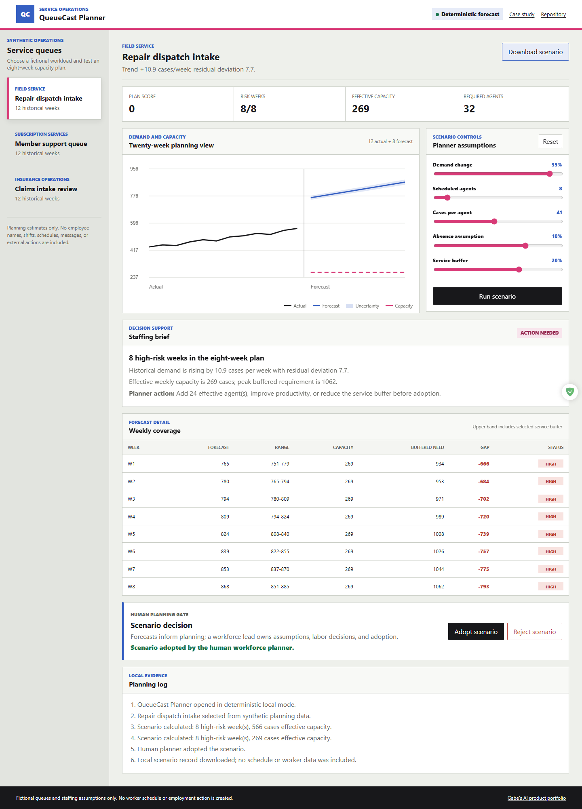
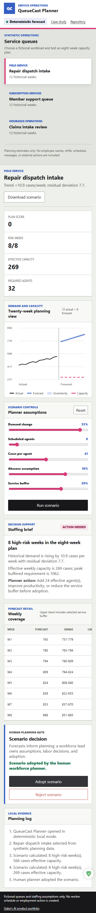

# QueueCast Planner

QueueCast Planner is an explainable forecasting and capacity-simulation workspace for service operations. It turns synthetic weekly history into an eight-week demand range, lets planners test staffing assumptions, and keeps adoption with a human workforce lead.

[Live demo](https://jubjub-cpu.github.io/queuecast-planner/) | [Portfolio](https://jubjub-cpu.github.io/gabe-ai-product-portfolio/) | [v1.0.0 release](https://github.com/jubjub-cpu/queuecast-planner/releases/tag/v1.0.0)

## Business Problem

Service teams often receive either a spreadsheet of historical volume or a single opaque forecast. They need to see uncertainty, effective capacity, buffered demand, coverage gaps, and the assumptions behind staffing recommendations.

QueueCast replaces the archived PilotMap weighted-scoring concept with quantitative decision support that adds forecasting, scenario simulation, and uncertainty evidence to the portfolio.

## Target User

Workforce planners and service operations leads preparing an eight-week staffing plan.

## Workflow

1. Choose one of three fictional service queues with 12 historical weeks.
2. Inspect the explainable linear trend and residual uncertainty range.
3. Adjust demand change, scheduled agents, productivity, absence, and service buffer.
4. Compare weekly demand ranges with effective capacity and buffered need.
5. Review risk weeks, required agents, coverage gaps, and a quantified staffing brief.
6. Adopt or reject the scenario at a human planning gate.
7. Download a local JSON scenario record.

## Forecast and Scenario Method

- Least-squares linear trend over all 12 history points.
- Residual deviation expands into a visible uncertainty band over the eight-week horizon.
- Scenario demand applies the planner's demand adjustment.
- Effective capacity equals agents times productivity times one minus absence.
- Buffered need uses the upper forecast bound times the service buffer.
- Risk is classified from buffered need divided by effective capacity.

The method is deterministic and intentionally explainable. It is not a production forecasting model.

## Architecture

- `assets/forecast.mjs`: trend, uncertainty, scenario, scoring, brief, and export logic.
- `assets/app.js`: scenario controls, Canvas chart, table, decisions, and downloads.
- `data/queues.json`: fictional queue history and default assumptions.
- `tests/forecast.test.mjs`: mathematical and boundary checks.
- `tests/browser-smoke.mjs`: desktop, mobile, keyboard, Canvas, scenario, export, failure, and deployed checks.

See [docs/ARCHITECTURE.md](docs/ARCHITECTURE.md) and [docs/CASE_STUDY.md](docs/CASE_STUDY.md).

## Run Locally

```powershell
powershell -ExecutionPolicy Bypass -File .\tools\static-server.ps1 -NodePath "C:\path\to\node.exe"
```

Open `http://127.0.0.1:4180/`.

## Validation

```powershell
powershell -ExecutionPolicy Bypass -File .\tests\validate.ps1 -NodePath "C:\path\to\node.exe"
node .\tests\browser-smoke.mjs
```

Exact evidence is recorded in [docs/VALIDATION.md](docs/VALIDATION.md).

## Accessibility, Privacy, and Security

- Native range controls, semantic table and headings, skip navigation, visible focus, responsive layout, and reduced motion.
- Synthetic queue volumes and staffing assumptions only.
- No employee identities, schedules, messages, credentials, analytics, cookies, external API, or persistent storage.
- Export contains assumptions and aggregate synthetic results only.

## Screenshots





## Limitations

- Linear trend is vulnerable to seasonality, structural breaks, promotions, and sparse history.
- Uncertainty is an illustrative residual band, not a calibrated prediction interval.
- Staffing math omits skills, shifts, labor rules, handle-time distributions, and intraday arrivals.
- No worker schedule or employment action is created.

## AI-Assisted Development

Product direction, scenario definitions, mathematical checks, workflow design, visual review, and release decisions were directed by Gabe with AI-assisted implementation support. No customer use, production result, or traditional engineering employment is claimed.
